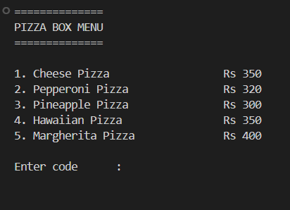
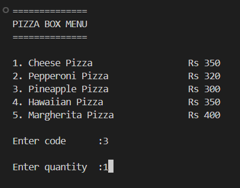
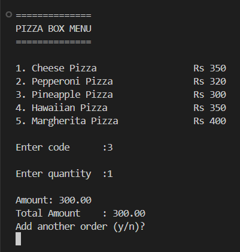
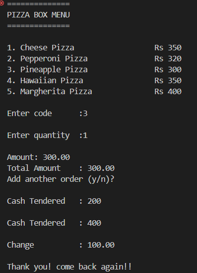

# C-billing-system 📋🍕

Welcome to the **c-billing-system**! This project is a simple billing system for a pizza store, written in C. It allows users to select from a menu of pizzas, enter quantities, and calculate the total bill along with any change if cash is provided. 

## Features ✨
- Display a menu of pizzas with their prices
- Allow users to select a pizza and enter the quantity
- Calculate the total amount for the order
- Option to add multiple orders
- Accept cash tendered and calculate change

## Usage 🚀

### Prerequisites
- C Compiler (e.g., GCC)

### Running the Program
1. **Clone the repository:**
    ```sh
    git clone https://github.com/aryanraw/C-billing-system.git
    cd C-billing-system
    ```
2. **Compile the program:**
    ```sh
    gcc -o main.c
    ```
3. **Run the executable:**
    ```sh
    ./main.c
    ```

### Menu Options 🍕

1. **Cheese Pizza** - Rs 350
2. **Pepperoni Pizza** - Rs 320
3. **Pineapple Pizza** - Rs 300
4. **Hawaiian Pizza** - Rs 350
5. **Margherita Pizza** - Rs 400

### Example Workflow
1. The program will display the pizza menu.
2. Enter the code corresponding to the pizza you want to order.
3. Enter the quantity.
4. The program will display the amount for the selected pizza and the running total.
5. You will be asked if you want to add another order.
6. Once all orders are added, enter the cash amount tendered.
7. The program will calculate and display the change.
8. A thank you message will be displayed.

## Screenshots 📸

### Menu Display


### Order Entry


### Total Amount Calculation


### Cash Handling


## Code Breakdown 🧩

### Variables
- `int code` - Stores the pizza code entered by the user.
- `int qty` - Stores the quantity of pizza ordered.
- `float price` - Stores the price of the selected pizza.
- `float amt` - Stores the amount for the current order.
- `float totalAmt` - Stores the running total amount for all orders.
- `float cash` - Stores the cash tendered by the user.
- `char addAnother` - Stores the user's choice to add another order.

### Main Loop
The program uses a `do-while` loop to:
- Clear the screen and display the menu.
- Accept user input for pizza code and quantity.
- Calculate and display the amount for the current order and update the total amount.
- Ask the user if they want to add another order.
- Repeat until the user decides to stop adding orders.

### Cash Handling
A `do-while` loop ensures that the cash tendered is enough to cover the total amount. It then calculates and displays the change.
